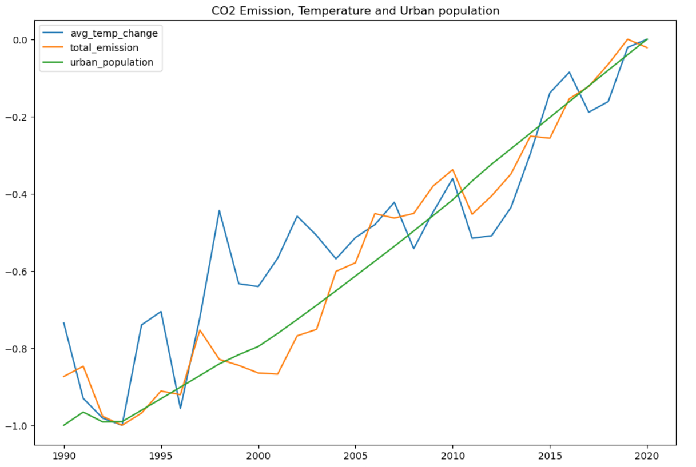
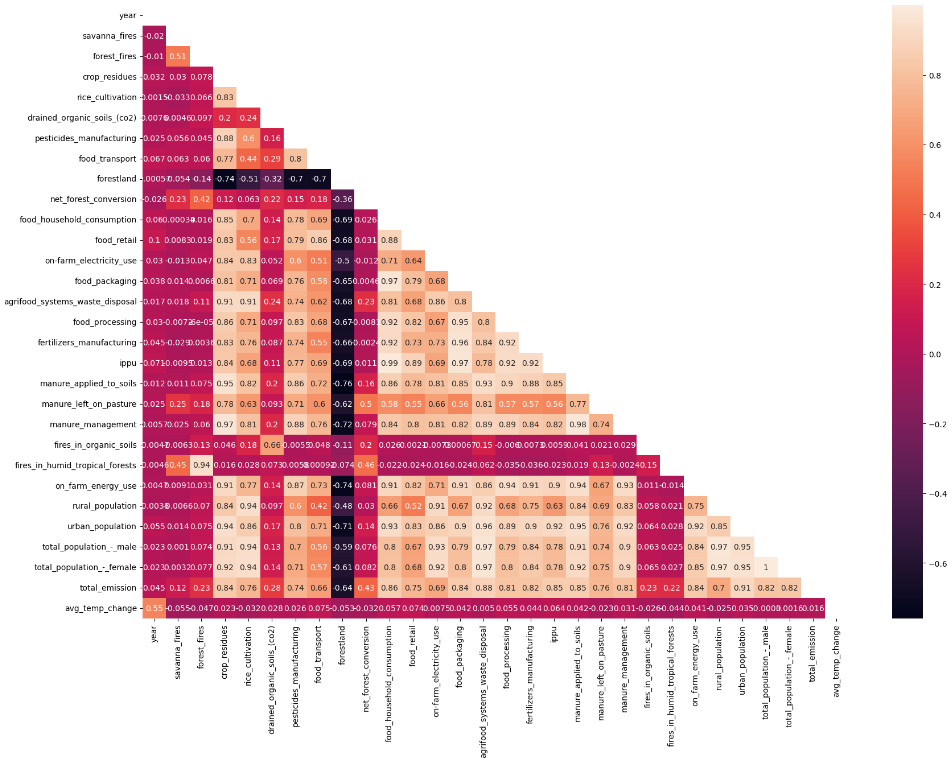
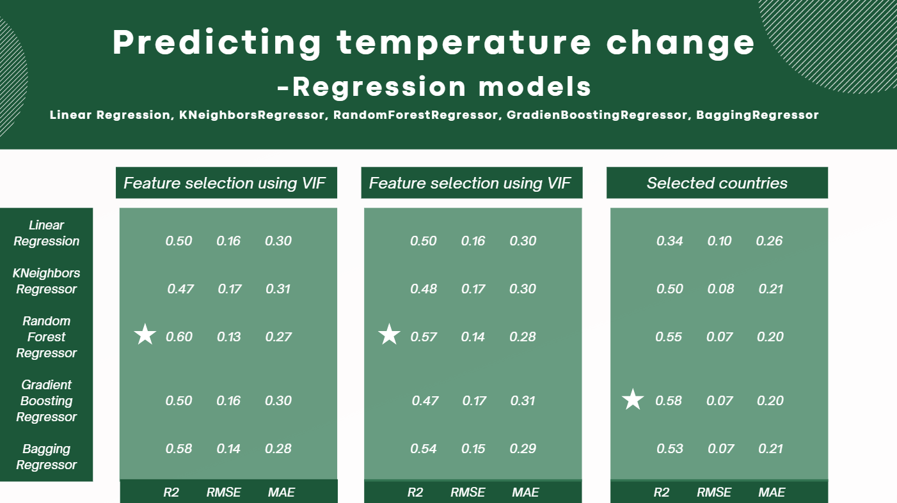
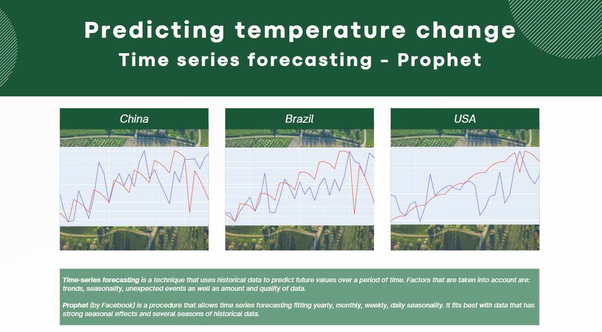

# Agri-food emissions and temperature changes - Ironhack Final Project

## Introduction
This project was prepared as a final project for Ironhack Data Analytics Bootcamp. 

**The objective** was to analyse the dataset, create a dashboard which will allow the users to explore the data and to create a machine learning models predicting a target variable: average temperature change.

This repository was created in order to present the results of my work and it consists of: 

1. **Files folder** - containt the dataset used in the analysis. 
2. **Python code** - Jupyter Notebook file containing Python code with machine learning models
3. **A Dashboard** - Tableau dashboard was built to allow an easy navigation through the main findings. It offers geographic filtering (using the map) and Year filter. 
4. **Presentation** - slides used during the final presentation of the project. 

## Dataset
The dataset was created based on the multiple datasets from FAO and IPCC and provides the information about emissions from agri-food industry between 1990 and 2020. The original dataset used can be found here: https://www.kaggle.com/datasets/alessandrolobello/agri-food-co2-emission-dataset-forecasting-ml/data. 

**Dataset Features:**
- Savanna fires: Emissions from fires in savanna ecosystems.
- Forest fires: Emissions from fires in forested areas.
- Crop Residues: Emissions from burning or decomposing leftover plant material after crop harvesting.
- Rice Cultivation: Emissions from methane released during rice cultivation.
- Drained organic soils (CO2): Emissions from carbon dioxide released when draining organic soils.
- Pesticides Manufacturing: Emissions from the production of pesticides.
- Food Transport: Emissions from transporting food products.
- Forestland: Land covered by forests.
- Net Forest conversion: Change in forest area due to deforestation and afforestation.
- Food Household Consumption: Emissions from food consumption at the household level.
- Food Retail: Emissions from the operation of retail establishments selling food.
- On-farm Electricity Use: Electricity consumption on farms.
- Food Packaging: Emissions from the production and disposal of food packaging materials.
- Agrifood Systems Waste Disposal: Emissions from waste disposal in the agrifood system.
- Food Processing: Emissions from processing food products.
- Fertilizers Manufacturing: Emissions from the production of fertilizers.
- IPPU: Emissions from industrial processes and product use.
- Manure applied to Soils: Emissions from applying animal manure to agricultural soils.
- Manure left on Pasture: Emissions from animal manure on pasture or grazing land.
- Manure Management: Emissions from managing and treating animal manure.
- Fires in organic soils: Emissions from fires in organic soils.
- Fires in humid tropical forests: Emissions from fires in humid tropical forests.
- On-farm energy use: Energy consumption on farms.
- Rural population: Number of people living in rural areas.
- Urban population: Number of people living in urban areas.
- Total Population - Male: Total number of male individuals in the population.
- Total Population - Female: Total number of female individuals in the population.
- total_emission: Total greenhouse gas emissions from various sources.
- Average Temperature °C: The average increasing of temperature (by year) in degrees Celsius

## Data analysis
Data analysis was done in Jupyter Notebook (Python) and through plots in Tableau.

In order to understand the correlations among the features I applied **Variance Inflation Factor** analysis and **Principal Component Analysis**. 

## Machine learning models
Searching for the best performing model I tried 5 regression models as well as time series forecasting using Prophet. 

### Regression models

### Time series forecasting using Prophet

